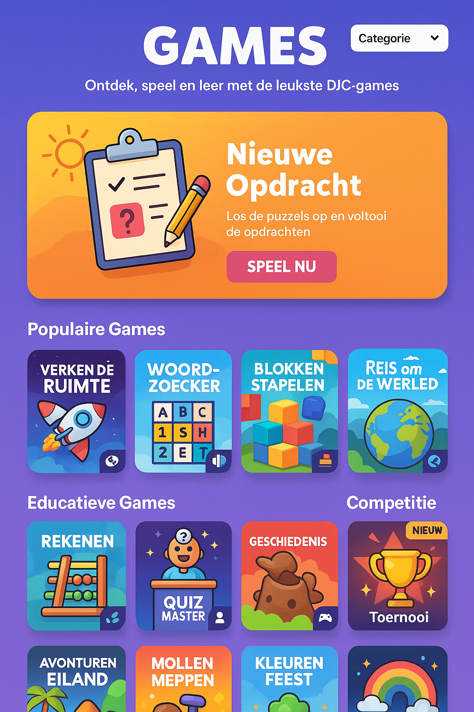

# DJC-Gaming Hub - Design & Functioneel overzicht

## Indeling

### Header
- Titel: DJC-Gaming
- Subtitel: "Speel, leer en win!"
- Categorie-dropdown: Populair, Educatief, Competitie

### Highlight-blok
- Uitgelichte game: grote banner met "Speel nu" knop
- Suggestie: DJC-Game-Words als eerste highlight

### Categorieën & Games
#### Populair
- DJC-Game-Words
- DJC-Game-Numbers
- DJC-Game-Trivia

#### Educatief
- DJC-Game-Words
- DJC-Game-Numbers
- DJC-Game-Quiz

#### Competitie
- DJC-Game-Words
- DJC-Game-Numbers
- DJC-Game-Trivia

### Game-kaarten
- Icoon (PNG/SVG)
- Titel en korte omschrijving
- Labels: Nieuw, Topscore
- Sponsor-branding (optioneel)
- Klik: start game als overlay/bovenaan

---

## Suggesties voor extra games
- DJC-Game-Numbers: reken- of telspel
- DJC-Game-Trivia: quiz met algemene kennis
- DJC-Game-Quiz: educatieve vragen
- DJC-Game-Avontuur: korte interactieve story
- DJC-Game-Memory: geheugenspel

---

## Volgende stap
- Uitwerken van de hubpagina in code (WordPress shortcode + HTML/CSS structuur)
- Overlay functionaliteit voor games
- Dynamisch laden van games per categorie
